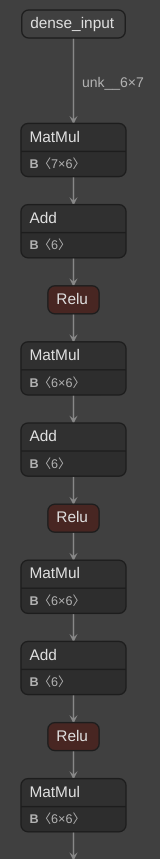
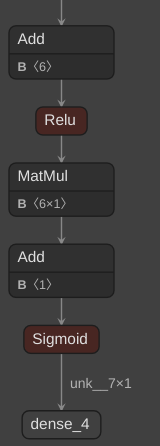
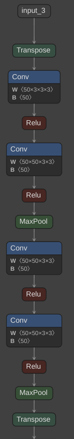
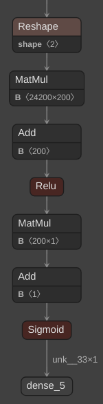

# Brain Hemorrhage and Stroke Diagnosis System (ONNX Version)

## Overview

This project combines Convolutional Neural Networks (CNN) and Artificial Neural Networks (ANN) to swiftly and accurately diagnose brain hemorrhage and stroke emergencies. The system is designed to enhance emergency medical care for patients experiencing brain hemorrhage and stroke incidents by providing rapid responses and high accuracy in diagnosis.

This repo specifically covers the ONNX (Open Neural Network Exchange) version of the project, which allows for easier deployment and interoperability across different platforms and frameworks.

## What is ONNX?

ONNX (Open Neural Network Exchange) is an open-source format for representing deep learning models. It enables interoperability between different deep learning frameworks, allowing models trained in one framework to be seamlessly transferred and used in another framework without the need for extensive rewriting or retraining.

Key features of ONNX include:

1. **Model Exchange**: ONNX facilitates the exchange of trained deep learning models between researchers, developers, and organizations. Models can be easily shared, reused, and integrated into various applications and workflows.

2. **Optimization**: ONNX includes tools and utilities for optimizing models for deployment on different hardware platforms and devices. This optimization process helps improve performance and efficiency, making models suitable for deployment in resource-constrained environments.

3. **Scalability**: ONNX supports a wide range of deep learning model architectures, including convolutional neural networks (CNNs), recurrent neural networks (RNNs), and transformers. This scalability enables the representation of complex models used in various domains such as computer vision, natural language processing, and reinforcement learning.

## Command Conversion

``python -m tf2onnx.convert --saved-model path/to/savedmodel --output dst/path/model.onnx --opset 13``

`path/to/savedmodel` should be the **path to the directory containing** `saved_model.pb`

## ONNX Visualization

1. ANN Strock Model:

|  |  |
| ---------------------------------------------------------- | ---------------------------------------------------------- |

2. CNN Hemorrhage Model:

|  |  |
| ---------------------------------------------------------- | ---------------------------------------------------------- |